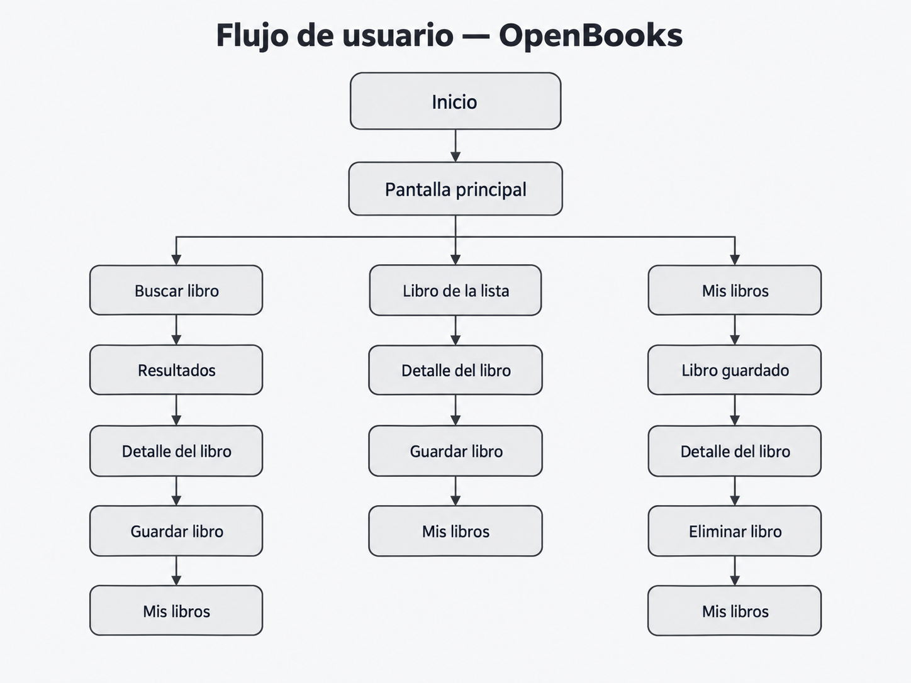
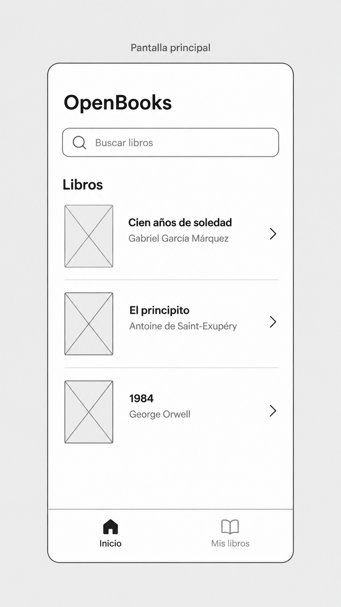
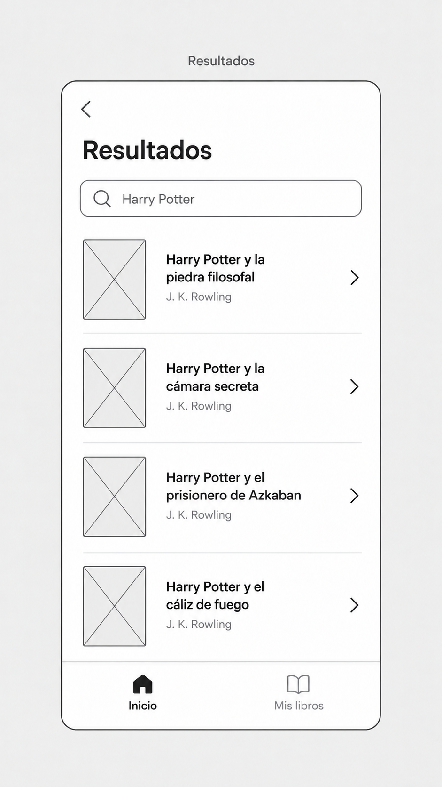
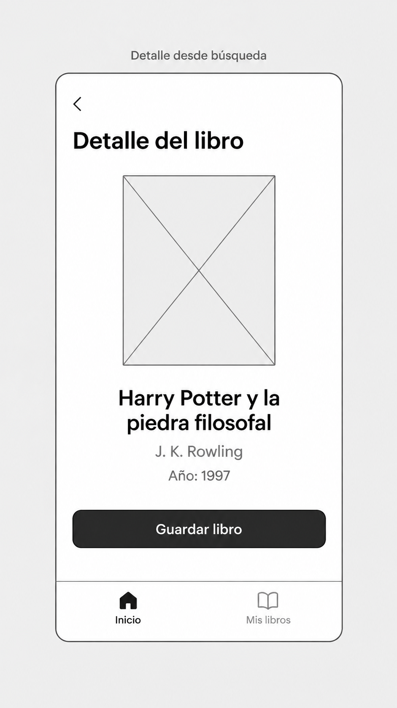
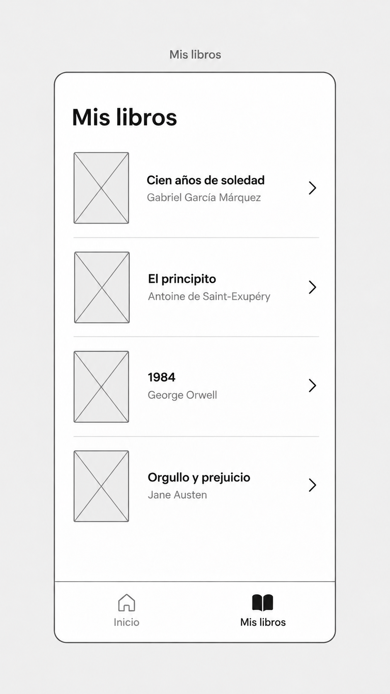
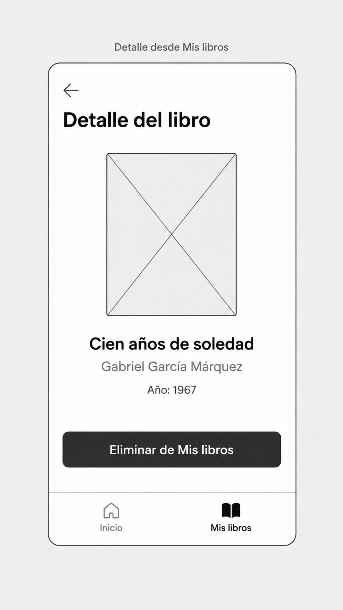
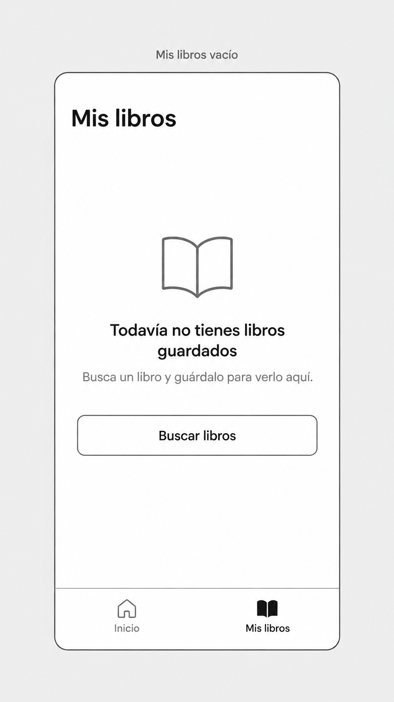

# OpenBooks

## Integrantes

- Romero Palacios Randy Rodrigo
- Villanueva García Emanuel

## Nombre del proyecto

**OpenBooks**

## Descripción del proyecto

OpenBooks es una aplicación iOS que permitirá buscar libros mediante Open Library, consultar la información básica de cada libro y administrar una colección personal de libros guardados.

La aplicación estará desarrollada principalmente con SwiftUI.

## Objetivo

Permitir que el usuario explore y busque libros, consulte sus datos principales y pueda guardar o eliminar libros de una colección personal.

## Funcionalidades del MVP

La aplicación incluirá:

- Una pantalla principal con una lista de libros.
- Búsqueda de libros mediante Open Library.
- Visualización de resultados de búsqueda.
- Visualización del detalle de cada libro.
- Portada del libro cuando esté disponible.
- Título del libro.
- Autor o autores.
- Año de publicación cuando esté disponible.
- Opción para guardar libros.
- Opción para eliminar libros guardados.
- Una sección llamada "Mis libros".
- Persistencia local de los libros guardados.
- Manejo de estados de carga.
- Manejo de errores.
- Manejo de búsquedas sin resultados.
- Manejo de libros sin portada.
- Manejo del estado de lista de libros guardados vacía.

## Flujo de usuario

La aplicación tendrá dos secciones principales:

- **Inicio**
- **Mis libros**

Desde la pantalla principal, el usuario podrá seleccionar directamente un libro de la lista para consultar su detalle o realizar una búsqueda.

Al realizar una búsqueda, la aplicación mostrará los resultados obtenidos de Open Library. El usuario podrá seleccionar un resultado para acceder al detalle del libro.

Desde la pantalla de detalle, la aplicación comprobará si el libro ya se encuentra guardado.

- Si el libro no está guardado, se mostrará la opción **Guardar libro**.
- Si el libro ya está guardado, se mostrará la opción **Eliminar de Mis libros**.

La sección **Mis libros** mostrará los libros almacenados localmente. Desde esta sección el usuario también podrá seleccionar un libro para consultar su detalle.

De esta manera, los diferentes flujos utilizan una misma pantalla de detalle y se conectan mediante el estado del libro y la navegación entre Inicio y Mis libros.

### Flujo general

**Detalle del libro** y **Mis libros** se repiten en el diagrama para mostrar con mayor claridad los distintos recorridos, pero corresponden a las mismas pantallas de la aplicación.

## Wireframes

Los siguientes wireframes representan la estructura inicial de las principales pantallas de la aplicación.

### Pantalla principal

La pantalla principal contiene el buscador, una lista inicial de libros y el acceso a la sección Mis libros.

### Resultados de búsqueda

Muestra los libros encontrados después de realizar una búsqueda.

### Detalle de un libro no guardado

Muestra la información del libro y permite guardarlo en la colección personal.

### Mis libros

Muestra los libros que el usuario ha guardado localmente.

### Detalle de un libro guardado

Muestra la información de un libro que ya pertenece a la colección del usuario y permite eliminarlo.

### Mis libros vacío

Este estado se mostrará cuando el usuario todavía no tenga libros guardados.

## Tecnologías previstas

- Swift
- SwiftUI
- Open Library API
- Navegación con SwiftUI
- Programación asíncrona con async/await
- Persistencia local
- Git y GitHub

## Estado actual del proyecto

Actualmente se encuentran definidos:

- El objetivo del proyecto.
- El MVP.
- El flujo principal de usuario.
- Los wireframes iniciales.
- La estructura inicial del repositorio.

La implementación de las pantallas y la integración con Open Library se desarrollarán progresivamente durante el proyecto.
